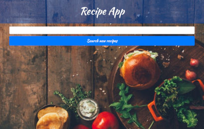
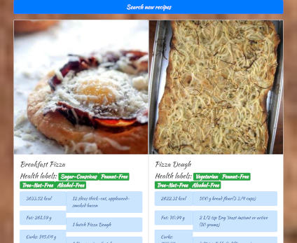
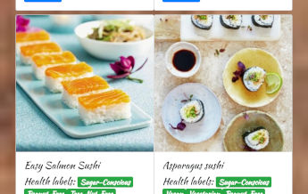
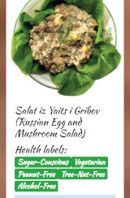

This project was bootstrapped with [Create React App](https://github.com/facebook/create-react-app).

# Recipe React APP
> Hi everyone! This is my version of simple Recipe React APP. 

## Live
https://mateuszlubianka1993.github.io/recipe-app-react/

## Technologies:
* React
* Java Script
* HTML5
* CSS 3
* Bootstrap

## General info
I made this app to learn basic skills in React. 
This is simple Recipe React APP. You can search recipes and get nutrional facts for this meals.
I used edamam Recipe Search API. 

## Screenshots

## Contact
Created by [lubiankamateusz@gmail.com] - feel free to contact me!